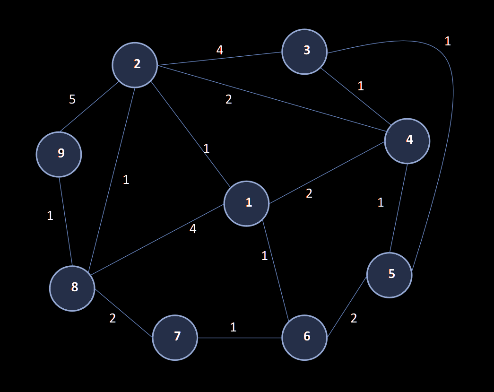
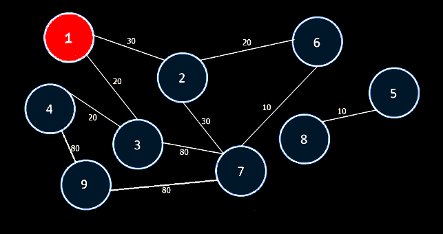

# ep1-aed2-test

Função main para testar o EP1 de AED2 (do professor Ivandré).

## Instruções

Siga o passo a passo:

1. Baixe o arquivo `main-testes-EP.c` para o diretório do seu código.
2. Altere a segunda linha `#include "arquivo.cpp"` para o nome do arquivo do
   seu EP.
3. Compile e rode o arquivo `main-testes-EP.c`

Se você estiver em um ambiente Linux (incluindo o Replit), você pode usar o
seguinte comando no bash:

```bash
# Substitua o comando abaixo pelo nome do arquivo do seu EP
ARQUIVO_TESTE=nome_do_arquivo.cpp
```

Em seguida, copie e cole os seguintes comandos:

```bash
# O comando seguinte baixa o arquivo main.c diretamente do GitHub
curl -O "https://raw.githubusercontent.com/MarcusPeixe/ep1-aed2-test/main/main-testes-EP.c"
# O comando seguinte adapta a diretriz include para o seu EP
sed -i "s/arquivo.cpp/$ARQUIVO_TESTE/" main-testes-EP.c

# O comando seguinte compila e roda o programa
gcc -Wall main-testes-EP.c -o main-testes && ./main-testes
```

Alternativamente, caso você esteja em uma IDE onde é difícil trabalhar com
mais de um arquivo, você pode copiar todo o conteúdo de `main-testes-EP.c` para o seu 
arquivo, substituindo a sua main.

Este código testa uma variedade de casos especiais no grafo-exemplo do
enunciado do EP.

## Grafo

Os dez testes oficiais utilizam o mesmo grafo:



O que muda entre cada teste são as salas que estão trancadas, a sala de início,
a da chave, e a de fim.
### Teste 1

- Início = 1, Chave = 3, Fim = 9.
- Salas fechadas = 2
- Resposta: 1, 8, 9
- Custo: 5

### Teste 2

- Início = 1, Chave = 7, Fim = 9.
- Salas fechadas = 2, 8
- Resposta: 1, 6, 7, 8, 9
- Custo: 5

### Teste 3

- Início = 1, Chave = 3, Fim = 9.
- Salas fechadas = 2, 8
- Resposta: 1, 4, 3, 4, 2, 8, 9
- Custo: 8

### Teste 4

- Início = 1, Chave = 3, Fim = 9.
- Salas fechadas = 2, 4, 8
- Resposta: 1, 6, 5, 3, 4, 2, 8, 9
- Custo: 9

### Teste 5

- Início = 9, Chave = 7, Fim = 4.
- Salas fechadas = (nenhuma)
- Resposta: 9, 8, 2, 4
- Custo: 4

### Teste 6

- Início = 9, Chave = 7, Fim = 4.
- Salas fechadas = 2
- Resposta: 9, 8, 1, 4
- Resposta: 9, 8, 7, 6, 1, 4
- Resposta: 9, 8, 7, 6, 5, 4
- Custo: 7

### Teste 7

- Início = 9, Chave = 7, Fim = 4.
- Salas fechadas = 1, 2
- Resposta: 9, 8, 7, 6, 1, 4
- Resposta: 9, 8, 7, 6, 5, 4
- Custo: 7

### Teste 8

- Início = 9, Chave = 7, Fim = 4.
- Salas fechadas = 8
- Resposta: 9, 2, 4
- Custo: 7

### Teste 9

- Início = 8, Chave = 3, Fim = 6.
- Salas fechadas = 2, 5, 6
- Resposta: 8, 1, 4, 3, 5, 6
- Custo: 10

### Teste 10

- Início = 8, Chave = 3, Fim = 6.
- Salas fechadas = 1, 5, 6
- Resposta: 8, 2, 4, 3, 5, 6
- Custo: 7

---

## Testes antigos

O código possui ainda alguns testes antigos que foram utilizados antes dos testes
oficiais serem disponibilizados. Estes testes são um pouco mais rígidos que os
oficiais, mas ainda assim são interessantes de se analizar e verificar se o seu
programa está *verdadeiramente* correto!

O teste 1 utiliza o seguinte grafo (caminho mais curto: 1, 4, 5):


---

O teste 2 utiliza um grafo muito denso para representar em imagem, mas o
caminho de menor custo é uma única aresta (que liga o início 5 direto ao
fim 12).

---

O teste 3 utiliza o seguinte grafo (caminho mais curto com chave: 9, 5, 7, 10, 4, 2):


---

O teste 4 utiliza o seguinte grafo (caminho mais curto: 5, 1, 2, 8, 4):


---

A partir do teste 5, o grafo utilizado é o grafo de exemplo, e a principal alteração
é as posições dos vértices *início*, *chave*, e *fim*.




