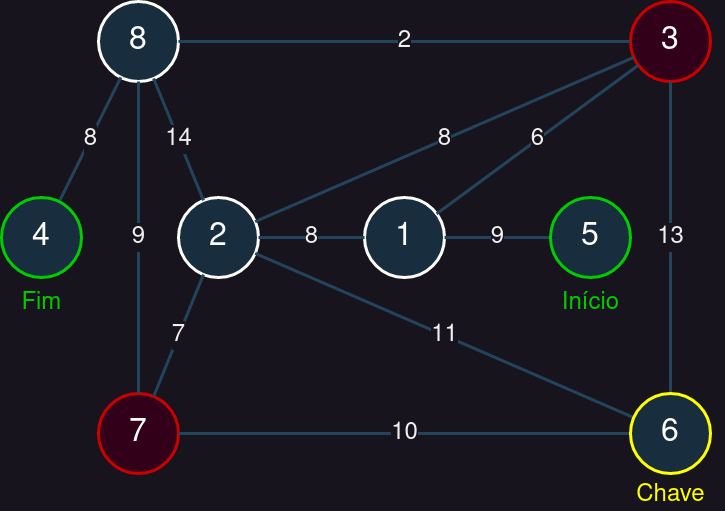

# ep1-aed2-test

Função main para testar o EP1 de AED2 (do professor Ivandré).

## Instruções

Siga o passo a passo:

1. Baixe o arquivo `main.c` para o diretório do seu código.
2. Altere a segunda linha `#include "arquivo.cpp"` para o nome do arquivo do
   seu EP.
3. Compile e rode o arquivo `main.c`

Se você estiver em um ambiente Linux (incluindo o Replit), você pode usar os
seguintes comandos no bash:

```bash
# O seguinte comando baixa o arquivo main.c diretamente do GitHub
curl -O "https://raw.githubusercontent.com/MarcusPeixe/ep1-aed2-test/main/main.c"
# No proximo comando troque NOME_DO_SEU_ARQUIVO.cpp pelo nome do seu arquivo
sed -i 's/arquivo.cpp/NOME_DO_SEU_ARQUIVO.cpp/' main.c
# O seguinte comando compila e roda o programa
gcc -Wall main.c -o test-main && ./test-main
```

Alternativamente, caso você esteja em uma IDE onde é difícil trabalhar com
mais de um arquivo, você pode copiar todo o conteúdo de `main.c` para o seu 
arquivo, substituindo a sua main.

Este código testa uma variedade de casos especiais no grafo-exemplo do
enunciado do EP.

## Grafos

O teste 1 utiliza o seguinte grafo (caminho mais curto: 1, 5, 4):


---

O teste 2 utiliza um grafo muito denso para representar em imagem, mas o
caminho de menor custo é uma única aresta (que liga o início 5 direto ao
fim 12).

---

O teste 3 utiliza o seguinte grafo (caminho mais curto com chave: 9, 5, 7, 10, 4, 2):


---

O teste 4 utiliza o seguinte grafo (caminho mais curto: 5, 1, 2, 8, 4):



---

A partir do teste 5, o grafo utilizado é o grafo de exemplo, e a única
alteração é as posições dos vértices *início*, *chave*, e *fim*.


